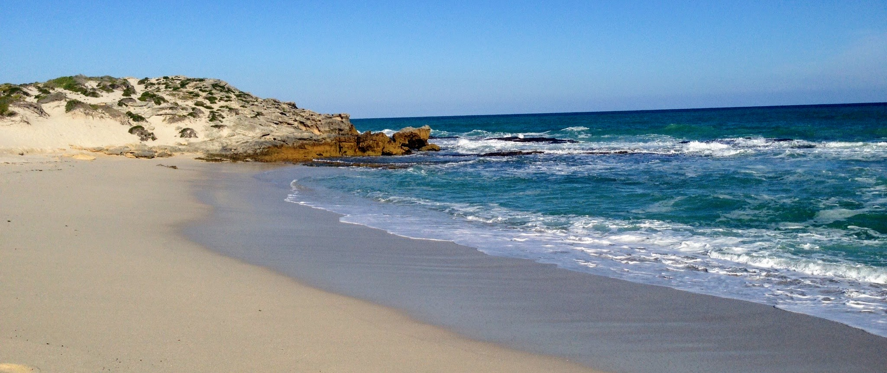

<iframe src="map.html" height="200" width="100%"></iframe>

<!-- Adam- Namaqua is shown on the map, how should we include it below?, also do we have an pretty pictures? -->
# Terrestrial Domain
***
The Greater Cape Floristic Region (GCFR) of southwestern Africa contains two global biodiversity hotspots (Succulent Karoo and Fynbos) with roughly 11,500 plant species in an area the size of Maine. The GCFR includes the intersections of seven biomes and is known for its extreme topographic and environmental heterogeneity. There is a long history of biodiversity research in the region; Darwin himself dedicated his opus on Evolution to the scientist (John Hershel) he visited at the Cape, and upon departure of the Beagle first made mention of "evolution" in his notebooks. The Cape region was also where G.E. Hutchinson first decided to become a limnologist and ecologist in 1928 while on a fellowship there. This scientific interest has translated over the past several decades to a rich archive of historical biodiversity observations and ongoing biodiversity data collection.

This scientific attention has led to the region’s extraordinary archive of field studies cataloguing the various dimensions of biodiversity. However, the factors determining the origin and maintenance of biodiversity in the GCFR remain unclear and the anticipated effects of climate change may have dramatic effects on thousands of endemic species. Given all of the independent, ground-based information available that can be brought to bear on this problem, the GCFR is an ideal system to fully evaluate the capabilities of remote-sensing technology to characterize biodiversity patterns across diverse landscapes.

#Marine 
***

<!--Adam I threw in a photo I had from De Hoop as a place holder, feel free to throw something with a better JPEG quality -->

South Africa’s oceans are broadly composed of both temperate and tropical marine biomes that have been classified into 35 biozones and 136 habitat types. These marine environments form the southern junction of the Atlantic and Indian Oceans and are predominated by two ocean currents: the cold Benguela Current on the Atlantic side and the warm Agulhas Current on the Indian side. Of the 42 estuaries along the South African coast, eight of the most diverse are along the GCFR coast. Upwelling conditions off the west and south-west coasts contribute to a high net productivity in the kelp bed ecosystems, which sustains a sizeable fishing and abalone farming industry. At peak period of upwelling, the Benguela upwelling system can achieve levels of nutrient cycling that are about 60-70 times greater than the averages of areas such as California and Peru. Perhaps due its Gondwanan origins, the oceans around South Africa have some of the highest levels of marine endemism globally. Approximately 28% of the total marine species are endemic, with over 3,500 endemic species recorded. Of importance from a remote sensing perspective, 10% of the world’s seaweed species are endemic to South Africa. Macroalgae (predominantly kelp) constitute the primary trophic level of many marine ecosystems which support a wide host of vertebrate and invertebrate life.

#Freshwater Aquatic
***

Similar to its terrestrial and marine environments, South Africa’s freshwater aquatic systems also display high amounts of endemism in both its vegetation and invertebrate fauna. It is listed among the World’s 200 Significant Ecoregions. Famously, the endemism in the shallow lakes, or vleis, around Cape Town sparked Evelyn Hutchinson’s initial interest in limnology and ecology.

South Africa is a chronically water-scarce country at high risk to the potential impacts of climate change. As precipitation cycles and water sources become more uncertain with climate change, South Africa’s freshwater ecosystems are not alone in their threatened existence. Remotely sensed data could answer many question such as the following that can lead to better understanding of freshwater biodiversity, resource and conservation implementation.